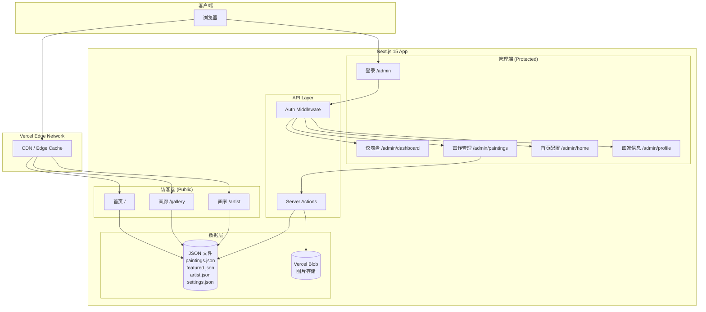

# 贝军国画网站 V2 技术设计文档

## 1. Overview

### 简介

将静态 HTML 画廊网站重构为 Next.js 15 App Router 全栈应用，实现沉浸式前台展示 + 简洁后台管理。

### Goals

- **极致性能**：LCP < 2.5s，首屏 JS < 100KB (gzipped)
- **沉浸式体验**：视差滚动、View Transitions、滚动触发动画
- **简洁管理**：画作上下架、信息编辑、首页配置
- **零数据库**：JSON 文件存储，Vercel Blob 图片托管
- **SEO 友好**：SSG + ISR，动态 sitemap

### Non-Goals

- 多用户/角色权限系统
- 购物车/在线支付
- 评论/互动功能
- 多语言支持（仅中文）
- 移动端原生 App

### 关键技术决策

| 决策 | 选择 | 理由 |
|------|------|------|
| 框架 | Next.js 15 App Router | RSC + Server Actions + ISR 原生支持 |
| 样式 | Tailwind CSS 4 + shadcn/ui | 极简主义 + 组件一致性 |
| 动画 | Framer Motion | 成熟稳定，支持 layout animations |
| 数据存储 | JSON 文件 | 轻量、无运维、Git 版本控制 |
| 图片存储 | Vercel Blob | 自动优化、Edge CDN、按量计费 |
| 认证 | NextAuth.js v5 | Credentials Provider，单用户场景 |
| 部署 | Vercel | 零配置、Edge 全球加速、ISR 原生支持 |

---

## 2. Architecture

### 系统架构图



### 目录结构

```
src/
├── app/
│   ├── (public)/                 # 访客端路由组
│   │   ├── page.tsx              # 首页
│   │   ├── gallery/
│   │   │   └── page.tsx          # 画廊页
│   │   └── artist/
│   │       └── page.tsx          # 画家介绍页
│   ├── admin/                    # 管理端路由
│   │   ├── page.tsx              # 登录页
│   │   ├── layout.tsx            # 管理端布局（含认证检查）
│   │   ├── dashboard/
│   │   │   └── page.tsx
│   │   ├── paintings/
│   │   │   ├── page.tsx          # 画作列表
│   │   │   └── [id]/
│   │   │       └── page.tsx      # 画作编辑
│   │   ├── home/
│   │   │   └── page.tsx          # 首页配置
│   │   └── profile/
│   │       └── page.tsx          # 画家信息
│   ├── api/
│   │   └── auth/
│   │       └── [...nextauth]/
│   │           └── route.ts      # NextAuth.js 路由
│   ├── layout.tsx                # 根布局
│   └── globals.css               # 全局样式
├── components/
│   ├── ui/                       # shadcn/ui 组件
│   ├── public/                   # 访客端组件
│   │   ├── Hero.tsx
│   │   ├── FeaturedGrid.tsx
│   │   ├── MasonryGallery.tsx
│   │   ├── Lightbox.tsx
│   │   ├── FilterBar.tsx
│   │   └── Navbar.tsx
│   └── admin/                    # 管理端组件
│       ├── PaintingCard.tsx
│       ├── ImageUploader.tsx
│       └── RichTextEditor.tsx
├── lib/
│   ├── data.ts                   # JSON 数据读写
│   ├── blob.ts                   # Vercel Blob 操作
│   ├── auth.ts                   # NextAuth 配置
│   └── utils.ts                  # 工具函数
├── actions/
│   ├── paintings.ts              # 画作 CRUD Actions
│   ├── home.ts                   # 首页配置 Actions
│   ├── artist.ts                 # 画家信息 Actions
│   └── upload.ts                 # 图片上传 Actions
├── types/
│   └── index.ts                  # TypeScript 类型定义
└── data/
    ├── paintings.json
    ├── featured.json
    ├── artist.json
    └── settings.json
```

### 渲染策略

| 页面 | 渲染模式 | 重验证策略 |
|------|----------|-----------|
| 首页 `/` | SSG + ISR | revalidate: 60s |
| 画廊 `/gallery` | SSG + ISR | revalidate: 60s |
| 画家 `/artist` | SSG + ISR | revalidate: 60s |
| 管理端 `/admin/*` | Dynamic (SSR) | 无缓存 |

---

## 3. Components and Interfaces

### 访客端核心组件

#### Navbar（隐形导航）

```typescript
interface NavbarProps {
  transparent?: boolean;  // 首页 Hero 区域时透明
}

// 行为规范
// - 首页：初始完全透明，滚动 100px 后显示毛玻璃效果
// - 非首页：默认毛玻璃效果
// - 向下滚动隐藏，向上滚动显示
// - 深色/浅色模式切换按钮
```

#### Hero（首页全屏横幅）

```typescript
interface HeroProps {
  backgroundImage: string;
  title: string;
  subtitle?: string;
}

// 行为规范
// - 视差滚动效果（背景图移动速度 0.5x）
// - 标题渐入动画（Framer Motion）
// - 滚动指示器（向下箭头 + 文字）
```

#### MasonryGallery（瀑布流画廊）

```typescript
interface MasonryGalleryProps {
  paintings: Painting[];
  columns?: {
    mobile: 1 | 2;
    tablet: 2 | 3;
    desktop: 3 | 4;
  };
  onPaintingClick: (id: string) => void;
}

// 使用 CSS columns 或 react-masonry-css
// 响应式断点：640px / 1024px / 1280px
```

#### Lightbox（画作详情模态框）

```typescript
interface LightboxProps {
  painting: Painting | null;
  onClose: () => void;
  onPrev: () => void;
  onNext: () => void;
}

// 行为规范
// - 键盘导航：ESC 关闭，← → 切换
// - 移动端拖拽关闭（向下拖 > 100px）
// - 图片缩放（双指捏合 / 双击）
// - "咨询购买" 显示微信二维码 + 一键复制
```

#### FilterBar（筛选栏）

```typescript
interface FilterBarProps {
  years: number[];
  statuses: PaintingStatus[];
  onFilterChange: (filters: FilterState) => void;
}

interface FilterState {
  year?: number;
  status?: PaintingStatus;
  search?: string;
}

// 行为规范
// - 固定在顶部（sticky）
// - 搜索框 300ms 防抖
// - 筛选状态同步到 URL query params
```

### Server Actions API

#### paintings.ts

```typescript
// 获取所有画作（支持筛选）
export async function getPaintings(filters?: FilterState): Promise<Painting[]>

// 获取单个画作
export async function getPainting(id: string): Promise<Painting | null>

// 创建画作
export async function createPainting(data: CreatePaintingInput): Promise<Painting>

// 更新画作
export async function updatePainting(id: string, data: UpdatePaintingInput): Promise<Painting>

// 删除画作
export async function deletePainting(id: string): Promise<void>

// 切换上架状态
export async function togglePublished(id: string): Promise<Painting>
```

#### home.ts

```typescript
// 获取首页配置
export async function getHomeSettings(): Promise<HomeSettings>

// 更新 Hero 区域
export async function updateHero(data: HeroInput): Promise<void>

// 更新精选画作
export async function updateFeatured(paintingIds: string[]): Promise<void>
```

#### upload.ts

```typescript
// 上传图片到 Vercel Blob
export async function uploadImage(formData: FormData): Promise<{
  url: string;
  thumbnailUrl: string;
}>

// 删除图片
export async function deleteImage(url: string): Promise<void>
```

### 路由保护

```typescript
// middleware.ts
import { auth } from "@/lib/auth"

export default auth((req) => {
  const isLoggedIn = !!req.auth
  const isAdminRoute = req.nextUrl.pathname.startsWith('/admin')
  const isLoginPage = req.nextUrl.pathname === '/admin'

  if (isAdminRoute && !isLoggedIn && !isLoginPage) {
    return Response.redirect(new URL('/admin', req.nextUrl))
  }

  if (isLoginPage && isLoggedIn) {
    return Response.redirect(new URL('/admin/dashboard', req.nextUrl))
  }
})

export const config = {
  matcher: ['/admin/:path*']
}
```

---

## 4. Data Models

### TypeScript 类型定义

```typescript
// types/index.ts

export type PaintingStatus = '售卖中' | '可定制' | '已售出';

export interface Painting {
  id: string;
  title: string;
  description: string;
  year: number;
  dimensions?: string;        // 如 "68cm x 136cm"
  status: PaintingStatus;
  imageUrl: string;           // 原图 URL
  thumbnailUrl: string;       // 缩略图 URL
  published: boolean;         // 是否上架
  order: number;              // 排序权重
  createdAt: string;          // ISO 8601
  updatedAt: string;
}

export interface Artist {
  name: string;
  title?: string;             // 如 "国家一级美术师"
  avatarUrl: string;
  bio: string;                // 支持富文本 HTML
  timeline?: TimelineItem[];
}

export interface TimelineItem {
  year: number;
  title: string;
  description?: string;
}

export interface HomeSettings {
  hero: {
    backgroundImage: string;
    title: string;
    subtitle?: string;
  };
  featuredPaintingIds: string[];  // 3 个精选画作 ID
  artistStatement?: string;       // 艺术理念（首页滚动章节）
}

export interface SiteSettings {
  siteName: string;
  wechatId: string;           // 咨询微信号
  wechatQrCode?: string;      // 微信二维码图片
}
```

### JSON 数据结构

#### paintings.json

```json
{
  "paintings": [
    {
      "id": "p001",
      "title": "春山云起",
      "description": "以浅绛山水技法描绘春日云烟缭绕之景",
      "year": 2024,
      "dimensions": "68cm x 136cm",
      "status": "售卖中",
      "imageUrl": "https://xxx.public.blob.vercel-storage.com/...",
      "thumbnailUrl": "https://xxx.public.blob.vercel-storage.com/...",
      "published": true,
      "order": 1,
      "createdAt": "2024-01-15T08:00:00Z",
      "updatedAt": "2024-01-15T08:00:00Z"
    }
  ],
  "lastUpdated": "2024-01-15T08:00:00Z"
}
```

#### featured.json

```json
{
  "featuredIds": ["p001", "p002", "p003"],
  "lastUpdated": "2024-01-15T08:00:00Z"
}
```

#### artist.json

```json
{
  "name": "贝军",
  "title": "国家一级美术师",
  "avatarUrl": "https://...",
  "bio": "<p>贝军，字...</p>",
  "timeline": [
    { "year": 1985, "title": "毕业于浙江美术学院" },
    { "year": 2000, "title": "入选全国美展" }
  ]
}
```

### 状态管理

```typescript
// 客户端状态使用 URL Search Params + React State
// 无需全局状态管理库

// 画廊页筛选状态
const [filters, setFilters] = useState<FilterState>(() => {
  const params = new URLSearchParams(searchParams);
  return {
    year: params.get('year') ? Number(params.get('year')) : undefined,
    status: params.get('status') as PaintingStatus | undefined,
    search: params.get('q') || undefined,
  };
});

// 同步到 URL
useEffect(() => {
  const params = new URLSearchParams();
  if (filters.year) params.set('year', String(filters.year));
  if (filters.status) params.set('status', filters.status);
  if (filters.search) params.set('q', filters.search);
  router.push(`/gallery?${params.toString()}`, { scroll: false });
}, [filters]);
```

---

## 5. Error Handling

### 错误场景与处理

| 场景 | 错误类型 | 用户提示 | 恢复策略 |
|------|----------|----------|----------|
| JSON 读取失败 | DataError | "数据加载失败，请刷新页面" | 显示重试按钮 |
| 图片上传失败 | UploadError | "图片上传失败：{reason}" | 保留表单数据，允许重试 |
| 图片超过 5MB | ValidationError | "图片大小不能超过 5MB" | 客户端预验证 |
| 认证失败 | AuthError | "用户名或密码错误" | 清空密码，保留用户名 |
| 会话过期 | SessionError | 自动跳转登录页 | 登录后返回原页面 |
| ISR 重验证失败 | RevalidateError | 静默（用户看到缓存版本） | 后台日志，下次重试 |

### 错误边界

```typescript
// app/error.tsx - 全局错误边界
'use client'

export default function Error({
  error,
  reset,
}: {
  error: Error & { digest?: string }
  reset: () => void
}) {
  return (
    <div className="flex flex-col items-center justify-center min-h-screen">
      <h2 className="text-xl font-semibold mb-4">出了点问题</h2>
      <p className="text-gray-600 mb-4">{error.message}</p>
      <button
        onClick={reset}
        className="px-4 py-2 bg-amber-600 text-white rounded"
      >
        重试
      </button>
    </div>
  )
}
```

### 日志与监控

```typescript
// lib/logger.ts
export function logError(error: Error, context?: Record<string, unknown>) {
  console.error('[ERROR]', {
    message: error.message,
    stack: error.stack,
    ...context,
    timestamp: new Date().toISOString(),
  });

  // 生产环境发送到 Sentry
  if (process.env.NODE_ENV === 'production') {
    // Sentry.captureException(error, { extra: context });
  }
}
```

---

## 6. Testing Strategy

### 测试金字塔

```
          ┌───────────┐
          │   E2E     │  ← Playwright（关键路径）
          │  (少量)    │
         ┌┴───────────┴┐
         │ Integration │  ← Vitest + Testing Library
         │   (适中)     │
        ┌┴─────────────┴┐
        │    Unit       │  ← Vitest
        │   (大量)      │
        └───────────────┘
```

### 单元测试

```typescript
// __tests__/lib/data.test.ts
describe('getPaintings', () => {
  it('should filter by year', async () => {
    const paintings = await getPaintings({ year: 2024 });
    expect(paintings.every(p => p.year === 2024)).toBe(true);
  });

  it('should filter by status', async () => {
    const paintings = await getPaintings({ status: '售卖中' });
    expect(paintings.every(p => p.status === '售卖中')).toBe(true);
  });

  it('should search by title', async () => {
    const paintings = await getPaintings({ search: '春山' });
    expect(paintings.some(p => p.title.includes('春山'))).toBe(true);
  });
});
```

### 集成测试

```typescript
// __tests__/components/MasonryGallery.test.tsx
describe('MasonryGallery', () => {
  it('renders paintings in masonry layout', () => {
    render(<MasonryGallery paintings={mockPaintings} />);
    expect(screen.getAllByRole('img')).toHaveLength(mockPaintings.length);
  });

  it('opens lightbox on click', async () => {
    render(<MasonryGallery paintings={mockPaintings} />);
    await userEvent.click(screen.getAllByRole('img')[0]);
    expect(screen.getByRole('dialog')).toBeInTheDocument();
  });
});
```

### E2E 测试

```typescript
// e2e/gallery.spec.ts
import { test, expect } from '@playwright/test';

test.describe('Gallery Page', () => {
  test('should filter paintings by year', async ({ page }) => {
    await page.goto('/gallery');
    await page.selectOption('[data-testid="year-filter"]', '2024');
    await expect(page).toHaveURL(/year=2024/);

    const paintings = page.locator('[data-testid="painting-card"]');
    await expect(paintings.first()).toBeVisible();
  });

  test('should open lightbox and navigate with keyboard', async ({ page }) => {
    await page.goto('/gallery');
    await page.click('[data-testid="painting-card"]:first-child');
    await expect(page.locator('[data-testid="lightbox"]')).toBeVisible();

    await page.keyboard.press('ArrowRight');
    await page.keyboard.press('Escape');
    await expect(page.locator('[data-testid="lightbox"]')).not.toBeVisible();
  });
});

test.describe('Admin', () => {
  test('should login and manage paintings', async ({ page }) => {
    await page.goto('/admin');
    await page.fill('[name="username"]', process.env.TEST_ADMIN_USER!);
    await page.fill('[name="password"]', process.env.TEST_ADMIN_PASS!);
    await page.click('[type="submit"]');

    await expect(page).toHaveURL('/admin/dashboard');
    await page.click('[href="/admin/paintings"]');
    await expect(page.locator('[data-testid="painting-list"]')).toBeVisible();
  });
});
```

### 关键测试路径

1. **访客浏览流程**
   - 首页加载 → 点击精选画作 → 跳转画廊并高亮 → 打开 Lightbox → 关闭

2. **画廊筛选流程**
   - 进入画廊 → 选择年份 → 选择状态 → 搜索关键词 → URL 更新 → 分享链接直达

3. **管理员发布流程**
   - 登录 → 上传新画作 → 填写信息 → 保存 → 上架 → 前台可见

4. **首页配置流程**
   - 登录 → 更换 Hero 背景 → 选择精选画作 → 保存 → 触发 ISR → 前台更新

---

## 附录：关键设计决策记录

### 决策 1：使用 JSON 文件而非数据库

| 方面 | 描述 |
|------|------|
| **决策** | 使用 JSON 文件存储所有数据，不引入数据库 |
| **背景** | 个人艺术家网站，数据量小（<200 幅画作），更新频率低 |
| **备选** | SQLite、Supabase、PlanetScale |
| **理由** | 零运维成本、Git 版本控制、部署简单、开发体验好 |
| **后果** | 并发写入需加锁、无复杂查询、数据量大时需迁移 |

### 决策 2：Server Actions 而非 API Routes

| 方面 | 描述 |
|------|------|
| **决策** | 所有数据操作使用 Server Actions，不创建 REST API |
| **背景** | Next.js 15 App Router 原生支持，类型安全 |
| **备选** | tRPC、REST API Routes |
| **理由** | 减少样板代码、端到端类型安全、自动处理表单 |
| **后果** | 仅限 Next.js 客户端调用，无法暴露给第三方 |

### 决策 3：Framer Motion 而非 View Transitions API

| 方面 | 描述 |
|------|------|
| **决策** | 核心动画使用 Framer Motion，View Transitions 作为增强 |
| **背景** | View Transitions 浏览器支持不完整（Safari 无支持） |
| **备选** | 纯 View Transitions、GSAP、Motion One |
| **理由** | Framer Motion 生态成熟、API 友好、兼容性好 |
| **后果** | 包体积增加 ~40KB (gzipped)，需优化 tree-shaking |
